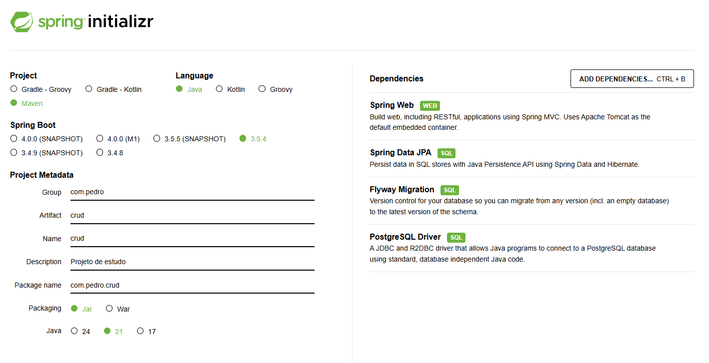

# Projeto CRUD API

# 🚀 Objetivo

O objetivo desse projeto é desenvolver um CRUD (Create, Update, Read, Delete) por meio da API projetada

# 🖥️ Preparação do ambiente e tecnologias aplicadas

## Requisitos necessários:
- JDK 21
- Maven
- Postman ou Insomnia (para fazer requisições HTTP)
- PgAdmin (PostgreSQL)
- IDE (IntelliJ, STS, Eclipse, VSCode, etc)

## Como será desenvolvido
- Uso do Spring Initalizr para criar o repositório do projeto
- PostgreSQL
- Flyway e conceito de Migrations

## Spring Initializr
Vá no [Spring Initializr](https://start.spring.io/) e siga as seguintes instruções:
- Adicione as dependências:
    - Spring Web;
    - Spring Data JPA;
    - Flyway Migration;
    - PostgreSQL Driver;
- Selecione a linguagem Java;
- Packaging sendo `jar`;
- Selecione a versão do seu JDK;

