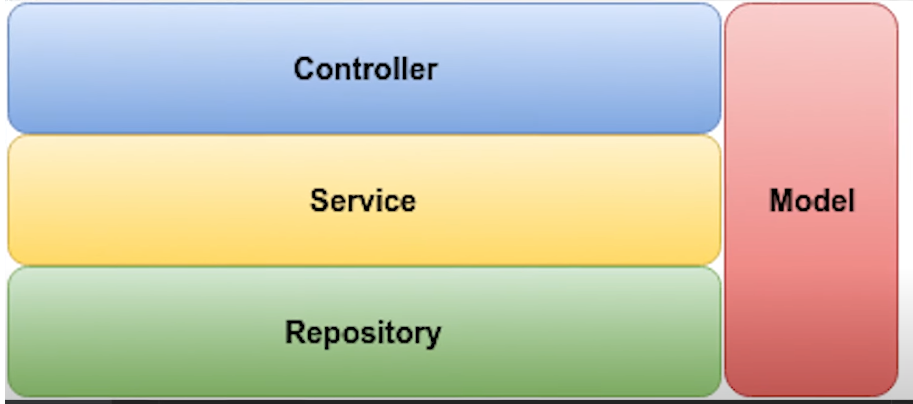

# Projeto CRUD API

# 🚀 Objetivo

O objetivo desse projeto é desenvolver um CRUD (Create, Update, Read, Delete) por meio da API projetada

# 🖥️ Preparação do ambiente e tecnologias aplicadas

## Requisitos necessários:
- JDK 21
- Maven
- Postman ou Insomnia (para fazer requisições HTTP)
- PgAdmin (PostgreSQL)
- IDE (IntelliJ, STS, Eclipse, VSCode, etc)

## Como será desenvolvido
- Uso do Spring Initalizr para criar o repositório do projeto
- PostgreSQL
- Flyway e conceito de Migrations

## Spring Initializr
Vá no [Spring Initializr](https://start.spring.io/) e siga as seguintes instruções:
- Adicione as dependências:
    - Spring Web;
    - Spring Data JPA;
    - Flyway Migration;
    - PostgreSQL Driver;
- Selecione a linguagem Java;
- Packaging sendo `jar`;
- Selecione a versão do seu JDK;

# Camadas de um projeto Spring

## Arquitetura do Projeto

Este projeto segue o padrão de **arquitetura em camadas** utilizando o Spring Boot, conforme ilustrado abaixo:

### 1. Controller (Camada de Apresentação)
- Recebe requisições HTTP e envia respostas.
- Converte dados de entrada (JSON, XML, etc.) para objetos Java.
- Encaminha as requisições para a camada **Service**.
- **Anotação principal:** `@RestController` ou `@Controller`.

### 2. Service (Camada de Negócio)
- Contém as regras de negócio da aplicação.
- Faz a ponte entre o **Controller** e o **Repository**.
- Aplica validações, cálculos e orquestra chamadas de métodos.
- **Anotação principal:** `@Service`.

### 3. Repository (Camada de Acesso a Dados)
- Responsável pela interação com o banco de dados.
- Executa operações de CRUD.
- Utiliza JPA/Hibernate ou SQL nativo.
- **Anotação principal:** `@Repository` (no Spring Data, pode ser implícita).

### 4. Model (Camada de Modelo)
- Representa os dados da aplicação.
- Inclui:
  - **Entities**: Classes anotadas com `@Entity` que mapeiam tabelas do banco.
  - **DTOs**: Objetos para transferência de dados entre camadas.
- Usada por todas as camadas para representar informações.

---

### **Fluxo de execução**:
1. O cliente envia uma requisição → **Controller**
2. O Controller chama o **Service**
3. O Service consulta o **Repository**
4. O Repository interage com o **Model** e o banco
5. A resposta sobe de volta ao cliente

